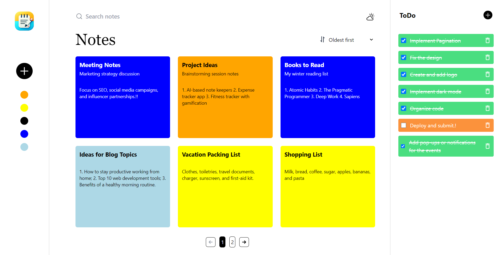

# NoteKeeper

NoteKeeper is a web application for managing notes and tasks efficiently. Built with React and Appwrite, it combines an intuitive interface with practical features to help users organize their day-to-day activities.

---

## Features

### Notes
- **Add Notes**: Create notes with a title, tagline, and body.
- **Color Categorization**: Use the colored dots in the sidebar to filter notes by color. This feature also adds a playful touch to the UI.
- **Pin Notes**: Pin important notes to ensure they appear at the top of the grid.
- **Edit Notes in Pop-up**: Click on a note to edit its content directly in a pop-up window.
- **Pagination**: View notes in a paginated layout, with a maximum of 6 notes per page for better readability.

### Tasks (Optional Feature)
- **Add Tasks**: Create a list of tasks alongside your notes.
- **Mark as Completed**: Check tasks as completed and see them styled differently.
- **Delete Tasks**: Easily remove tasks when they are no longer needed.

### Design and Usability
- **Custom Aesthetic**: The UI is vibrant, clean, and unconventional, with bold colors and a user-friendly layout.
- **Error Handling**: Toast notifications provide clear and concise feedback for user actions and errors.

---

## Tech Stack

### Frontend
- **React.js**: Dynamic and responsive UI.
- **TailwindCSS**: For styling and maintaining a consistent, modern aesthetic.
- **React-Icons**: Adds intuitive icons to enhance usability.
- **Toastify**: Displays error and success notifications elegantly.

### Backend
- **Appwrite**: A robust backend-as-a-service platform for managing CRUD operations.

### Deployment
- **Vercel**: The app is deployed using Vercel, ensuring a smooth and reliable experience.

---

## How to Use
1. Visit the live application [here](https://notezkeeper.vercel.app/).
2. Use the `+` button in the sidebar to add a new note or task.
3. Click on a colored dot in the sidebar to filter notes by category.
4. Manage tasks in the task panel by adding, completing, or deleting them.
5. Navigate through paginated notes using the controls at the bottom of the page.
